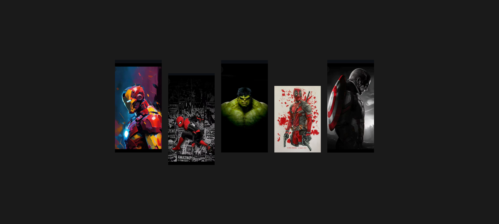
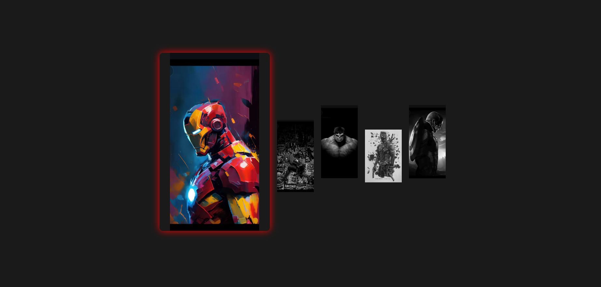
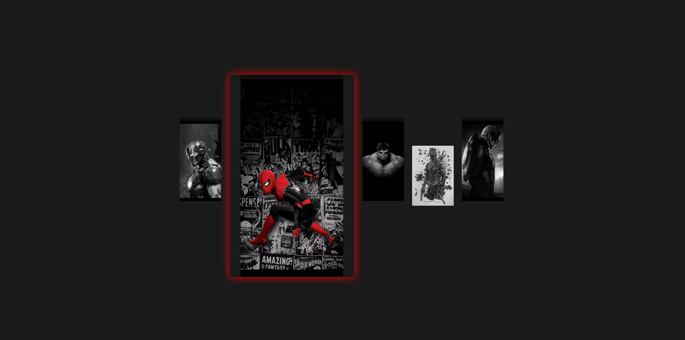
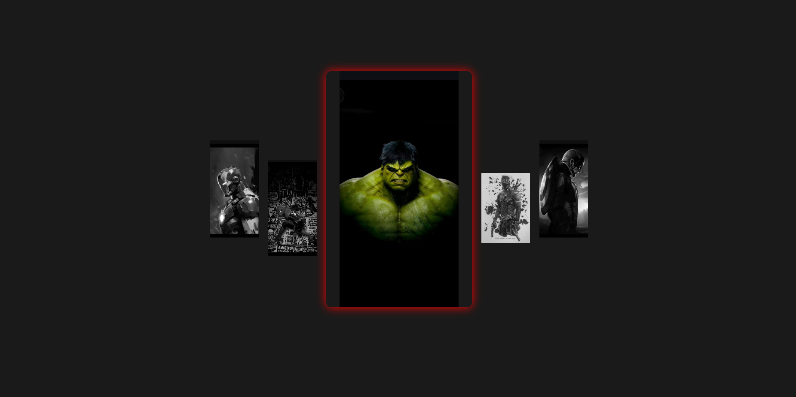
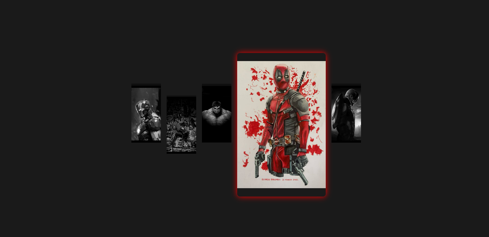
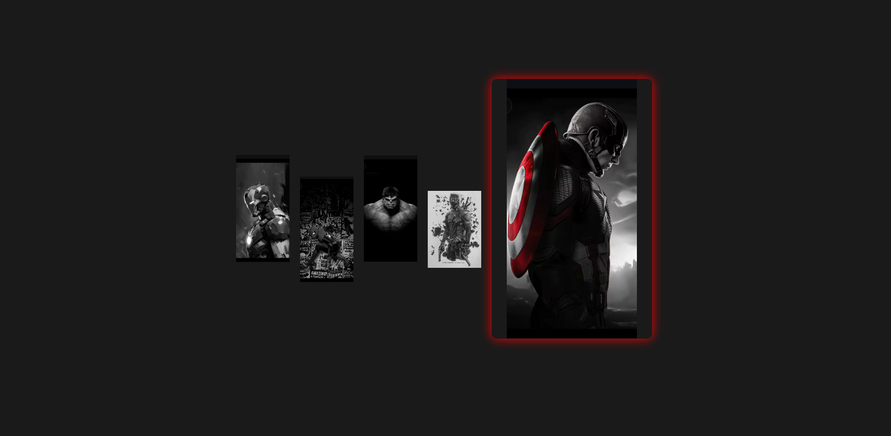

### 💥 Marvel Studios Gallery 💥
- Dive into the thrilling world of Marvel superheroes with the **Marvel Studios Gallery**! This project offers a visually stunning and interactive experience, showcasing iconic characters like Iron Man, Spider-Man, Hulk, Deadpool, and Captain America. Built with clean HTML and CSS, it's designed to captivate and inspire. h g

---

---

---

---

---

---

## 🚀 Overview
- The Marvel Studios Gallery is a web project that brings together the mightiest heroes of the Marvel universe in a sleek, responsive, and engaging format. Whether you're a die-hard Marvel fan or just appreciate great design, this gallery is sure to impress.

## ✨ Features
* **Interactive Image Gallery:** Each hero's image providing an immersive experience with captivating hover effects.

* **Smooth Transitions:** Utilizes CSS animations to create dynamic and visually appealing transitions between images.
  
## 🛠️ Technologies Used

* **HTML5:** Provides the structural foundation of the gallery layout, ensuring semantic and accessible markup.
 
* **CSS3:** Powers the styling and animations, delivering a visually appealing and dynamic user interface.
